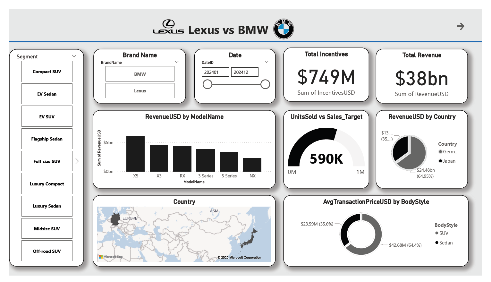

# Lexus vs BMW - 2024 Sales Analysis

**Project:** Lexus vs BMW — 2024 Sales Comparison  
**Author:** (Your name here)  
**Files provided:** `data/raw/Lexus_Vs_BMW_2024_Sales.csv`, `reports/Lexus vs BMW Analysis.pdf` (Power BI exports and dashboard screenshots)

---

## Executive summary
This repository contains the data, analysis notebooks, and supporting scripts used to compare Lexus and BMW sales performance for the 2024 calendar year. The dashboards (Power BI) reveal that BMW leads overall revenue and units sold for 2024, while Lexus shows higher average transaction values (particularly for SUVs) and greater total incentives. Key high-level numbers (from the uploaded dashboard snapshot) are cited in the analysis report inside `reports/`. See [dashboard visuals](reports/LexusVsBMWAnalysis.pdf) for the full report view.

---



## Key findings (high level)
- **Total combined revenue:** $38bn (dashboard total).  
- **BMW total revenue:** ~$24bn; **Lexus total revenue:** ~$13.21bn.  
- **Units sold (year):** BMW ~590K; Lexus ~239K (dashboard indicators).  
- **Total incentives:** Lexus ~$749M; BMW ~$458M.  
- **Top revenue models (examples):**  
  - BMW: X5 (~$6.1bn), X3 (~$4.4bn), 3 Series (~$3.8bn).  
  - Lexus: RX (~$4.3bn), NX (~$2.3bn), ES (~$1.7bn).  
- **Body-style & pricing:** SUVs dominate revenue share. Dashboard shows Lexus SUV avg transaction notably high (~$22.6M for SUVs vs $5.92M for sedans), and BMW SUV vs sedan values shown around ~$20.08M vs ~$17.68M.  
All numbers above reflect values presented in the uploaded Power BI export.

---

## What this means (interpretation)
1. **BMW volume-led strategy:** BMW’s higher revenue and unit counts indicate strong market penetration and model mix—several high-selling models (X5, X3, 3 Series) are big contributors.  
2. **Lexus premium-per-unit:** Lexus shows higher average transaction values for SUVs, indicating a premium pricing strategy or higher-spec trim mix. However, Lexus sells fewer units, which limits total revenue despite higher per-unit receipts.  
3. **Incentives & margin pressure:** Lexus’s larger incentive spend (vs BMW) suggests heavier use of promotions to drive sales—important to analyze incentive per unit and the return on incentive spend (e.g., incremental units per $1M incentives).  
4. **SUV dominance:** Customers strongly prefer SUVs across both brands; this affects product planning, pricing, and inventory prioritization.

(Reported metrics come from the provided dashboard PDF.) fileciteturn0file0

---

## Recommended follow-up analyses (actionable)
- **Incentive ROI:** Compute incentives per unit and per incremental sale. Estimate contribution margin impact if cost data is available.  
- **Model-level profitability:** Merge MSRP / cost / options to compute gross margin by model and body-style.  
- **Price elasticity:** Run a time-series or panel regression to estimate how incentives and price changes affect volumes by market and segment.  
- **Country & channel breakdown:** Drill into country-level performance and dealer vs direct channels (if available).  
- **Stock / inventory & supply constraints:** Cross-check production and delivery lead-times vs sales to find lost-sales due to stockouts.

---

## Data quality checks (to run first)
- Confirm currency and units (numbers displayed in the dashboards may be aggregated and shown in millions — ensure the raw CSV `RevenueUSD` scale).
- Verify Date range and that `DateID` covers 2024 (dashboard shows `202401` → `202412`).
- Standardize country names and model naming (e.g., "3 Series" vs "3-Series").
- Check for duplicates and missing values (especially for `UnitsSold`, `IncentivesUSD`, `RevenueUSD`, `BodyStyle`).
- Confirm incentives definition (rebates, dealer incentives, manufacturer programs).

---

## Dashboard & visualization improvements
- Add an **Incentives per Unit** KPI card and conditional formatting to flag markets where incentives > X% of revenue.  
- Add **time-slicer** to compare rolling 12-month vs year-to-date performance.  
- Add a **map by country** with drill-through to model and segment.  
- Add **decomposition tree / waterfall** to show how model and country contributions sum to brand revenue.  
- Add **profitability view** (if cost data available) to show contribution margin by model and body-style.

---

## Deliverables included / recommended
- `data/raw/Lexus_Vs_BMW_2024_Sales.csv` — raw data snapshot (source CSV).  
- `dashboards/` — Power BI `.pbix` file(s) or exported visuals (if allowed).  
- `reports/` — static exports and executive slide deck. fileciteturn0file0

---

## Project structure
```
lexus-vs-bmw-2024/
├─ data/
│  ├─ raw/
│  │  └─ Lexus_Vs_BMW_2024_Sales.csv
├─ dashboards/
│  └─ LexusVsBMWAnalysis.pbix
│  └─ LexusVsBMW_dashboard.png
├─ reports/
│  └─ LexusVsBMWAnalysis.pdf
│  └─ Lexus_vs_BMW_2024_Sales_Analysis_Report.pdf
├─ README.md
└─ LICENSE
```

---

## How to reproduce (quick)
1. Clone the repo.  
2. Open and refresh `dashboards/Lexus_vs_BMW_2024.pbix` (or import the CSVs into Power BI) and republish.

---

## Next steps I can help with (pick any)
- Run the EDA and produce clean aggregate CSVs from `Lexus_Vs_BMW_2024_Sales.csv`.  
- Generate reproducible Power BI data model (tabular/CSV) and sample DAX measures.  
- Create a short executive slide deck summarizing findings and recommended actions.  
- Build a small web dashboard (Streamlit) to reproduce the visuals.

---

## License
Choose your license (e.g., MIT). Replace this section with your chosen license.

---
*Generated using your uploaded dashboards and exports.* fileciteturn0file0
